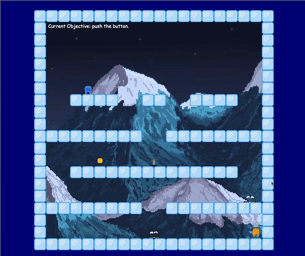

Worlds
----

A 2D, survival-mode, platformer game featuring particle emitters, rudimentary AI, and physics.

----
### Usage

Move to a temporary directory:

    cd /tmp

Checkout the source code:

    git clone https://github.com/johnyevsukov/worlds_demo.git

Navigate into the repo:

    cd worlds_demo/

Run the game:

    make game

__Note:__ You will need to have Python3 installed and have it available in your PATH.

----
#### Demo

